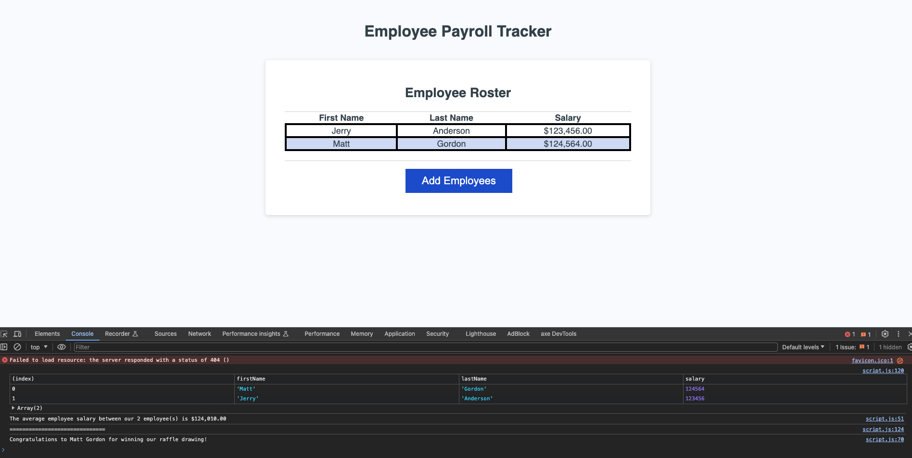

# Employee Payroll Tracker

## Purpose of this Project

This project works with existing code where javascript was added to add functionality to prompt a user to add employees and their salaries to a table. From there, it would calculate the average of the salaries and add a console log with the average.

This would also pick a random employee from the array and congratulate them for winning a raffle and that information would be displayed in the console.

## How to access

- The project is viewable on [Github Pages](https://mgordon82.github.io/employee-payroll-tracker/)
- The repository for this code is located on [GitHub](https://github.com/mgordon82/employee-payroll-tracker)

## User Story

```md
AS A payroll manager
I WANT AN employee payroll tracker
SO THAT I can see my employees' payroll data and properly budget for the company
```

## Acceptance Criteria

```md
GIVEN an employee payroll tracker
WHEN I click the "Add employee" button
THEN I am presented with a series of prompts asking for first name, last name, and salary
WHEN I finish adding an employee
THEN I am prompted to continue or cancel
WHEN I choose to continue
THEN I am prompted to add a new employee
WHEN I choose to cancel
THEN my employee data is displayed on the page sorted alphabetically by last name, and the console shows computed and aggregated data
```

## Mock-up of final product


